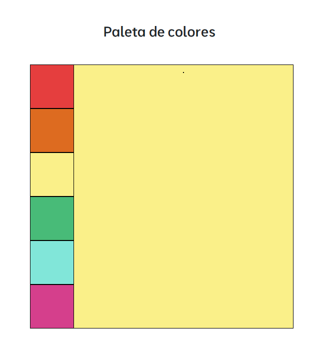

### **COLOR SELECTOR**

#### **Technologies Used**:
- **HTML5**:
  - `<select>` element with options for different colors.
- **CSS3**:
  - Styling for the main box and color options.
- **JavaScript**:
  - **Events**: Usage of the `click` event to detect color selections.
  - **DOM Manipulation**: Dynamically updates the styles of the main box.

#### **Features**:
1. Allows the user to select a color from a dropdown menu.
2. Changes the background color of a main box in real-time when a color is selected.
3. Provides clear and immediate visual feedback.

## **Screenshots**
<p align="center">
  
</p>

## **Installation**
1. Clone the repository:
   ```bash
   git clone https://github.com/yadicep/color selector.git
